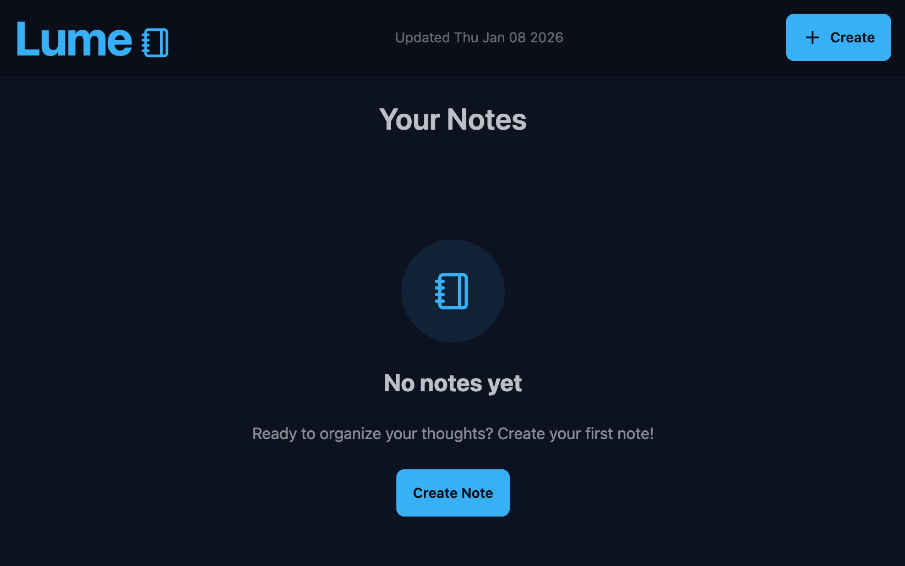
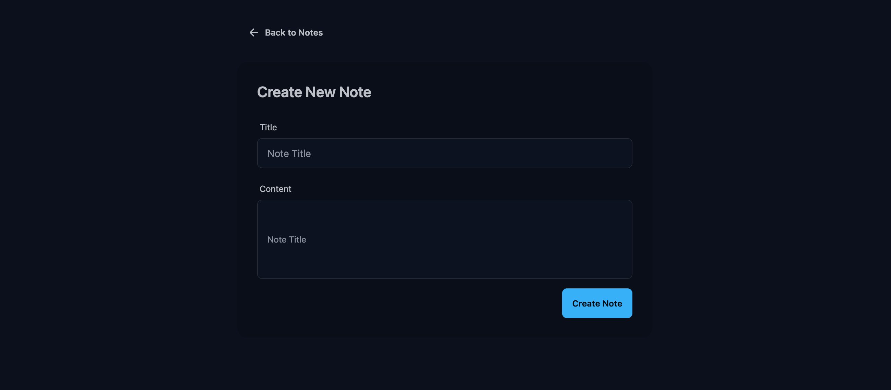
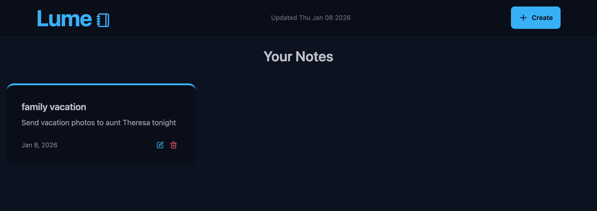
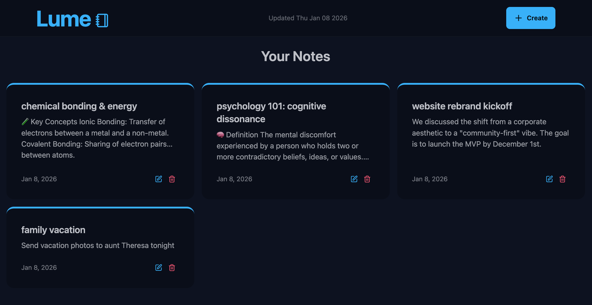
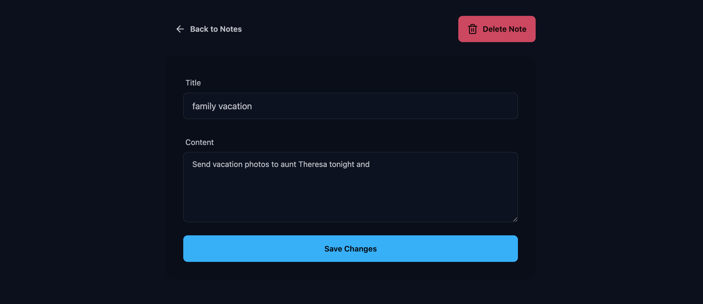

# Lume Notes

 
[](https://opensource.org/licenses/MIT)
[](https://render.com)

Lume Notes is a modern, full-stack note-taking application designed to help you capture and organize your thoughts effortlessly. Built with the MERN stack (MongoDB, Express, React, Node.js), it features a polished, responsive user interface and robust backend API.

## 🚀 Live Demo

Check out the live version of Lume Notes hosted on Render:  
**[Link](https://lume-notes.onrender.com)**
** Since it is a free service, it may take a few minutes to start up. Please be patient.**
** The URL is https://lume-notes.onrender.com**

## 📸 Screenshots








## ✨ Features

- **Create, Read, Update, Delete (CRUD)**: Manage your notes with ease.
- **Modern UI**: Built with React, Tailwind CSS, and DaisyUI for a beautiful, responsive design.
- **Fast Performance**: Powered by Vite for lightning-fast frontend tooling.
- **Secure Backend**: Express.js and Node.js backend with MongoDB storage.
- **Rate Limiting**: Integrated with Upstash (Redis) for API rate limiting.

## 🛠️ Tech Stack

### Frontend
- **Framework**: React 19
- **Build Tool**: Vite
- **Styling**: Tailwind CSS, DaisyUI
- **Routing**: React Router
- **HTTP Client**: Axios
- **Icons**: Lucide React
- **Notifications**: React Hot Toast

### Backend
- **Runtime**: Node.js
- **Framework**: Express.js
- **Database**: MongoDB (Mongoose)
- **Utilities**: Dotenv, Cors
- **Rate Limiting**: Upstash Redis

## ⚙️ Installation & Run Locally

Follow these steps to set up the project locally.

### Prerequisites
- Node.js (v18+ recommended)
- npm or yarn
- MongoDB instance (Local or Atlas)
- Upstash Redis (optional, for rate limiting)

### 1. Clone the repository
```bash
git clone https://github.com/TheGCraft/lume.git
cd lume
```

### 2. Install Dependencies
This project handles dependencies for both frontend and backend from the root.

```bash
# Install dependencies for both backend and frontend
npm run build
```
*Note: The build command in the root `package.json` installs dependencies for both folders and builds the frontend.*

Alternatively, you can install them manually:

```bash
cd backend && npm install
cd ../frontend && npm install
```

### 3. Environment Headers
Create a `.env` file in the `backend` directory with the following variables:

```env
PORT=5000
MONGO_URI=your_mongodb_connection_string
# Add other necessary variables (e.g., UPSTASH_REDIS_REST_URL, UPSTASH_REDIS_REST_TOKEN if used)
```

### 4. Run the Application

**Backend:**
To start the backend server:
```bash
# From the root directory
npm start
# OR from backend directory
cd backend
npm run dev
```

**Frontend:**
To start the frontend development server:
```bash
cd frontend
npm run dev
```

## 📂 Project Structure

```
lume/
├── backend/         # Express API and Database logic
│   ├── src/
│   │   ├── config/
│   │   ├── models/
│   │   ├── routes/
│   │   └── server.js
│   └── package.json
├── frontend/        # React + Vite application
│   ├── src/
│   │   ├── components/
│   │   ├── pages/
│   │   └── App.jsx
│   └── package.json
└── package.json     # Root configuration
```

## 👨‍💻 Author

**Guillermo Segura (TheGCraft)**  
📧 Email: guillermo.segura.cv@gmail.com  
🔗 GitHub: [TheGCraft](https://github.com/TheGCraft)

## 📄 License

This project is licensed under the MIT License.
